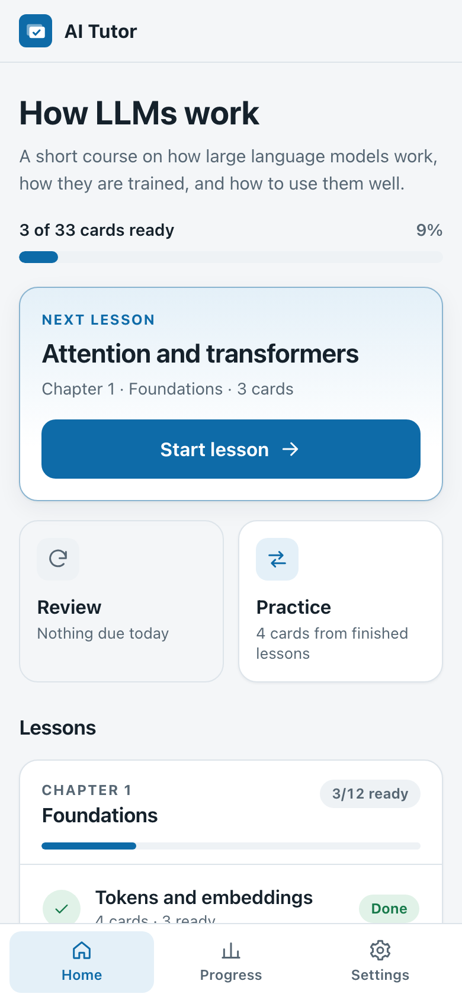
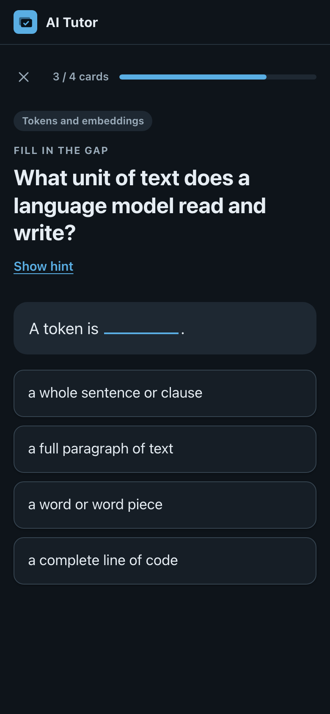
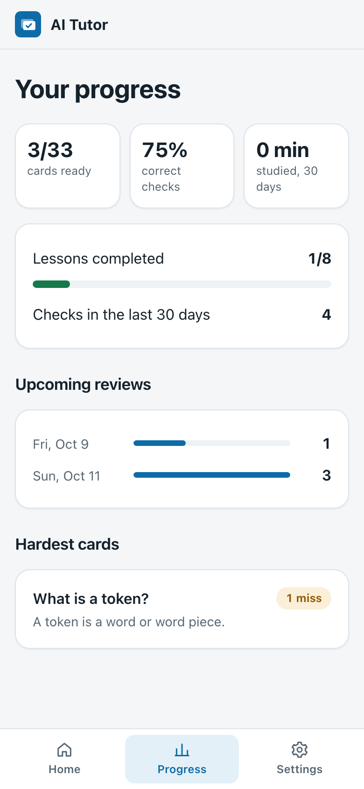
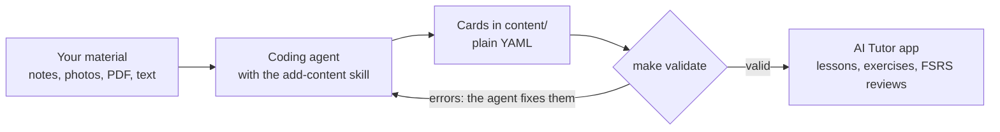

# AI Tutor

[](https://github.com/Marid5/ai-tutor/actions/workflows/ci.yml)
[](LICENSE)

Turn your notes into a spaced-repetition course — your coding agent writes the cards, AI Tutor teaches them.

Anki makes you write every card. Here your coding agent writes them, a validator rejects bad ones, and the server — not you — decides when a card is learned.

You give Claude Code or Codex your material: lesson notes, a photo of a textbook page, a PDF. The agent turns it into cards under a strict content contract, a validator checks every card, and a self-hosted web app teaches them with server-graded exercises and an FSRS review schedule. The repository ships with a demo course, "How LLMs work", so it runs on the first clone.

<p align="center">
  
  
  
</p>

## Who it's for

- **A language learner with lesson notes.** After each class, hand the agent your notes or a photo of the whiteboard; the vocabulary and phrases become a lesson, and reviews come back when you are about to forget them.
- **Someone preparing for an exam or a certification.** Point the agent at the syllabus chapter or your summary; every fact becomes one checkable card, and progress counts only answers the server verified.
- **A team onboarding people to a domain.** Turn the glossary, the runbook or the product rules into a course, deploy it on a small server and create an account per newcomer. Registration stays closed; accounts are made from the command line.

## How it works



1. **The agent writes the course.** [AGENTS.md](AGENTS.md) and the [add-content skill](.claude/skills/add-content/SKILL.md) tell it how: extract one fact per card, write three plausible wrong answers, propose the cards to you as a table, then file them into lessons with new ids.
2. **The validator is the gate.** [The content contract](docs/content-contract.md) is enforced by code: unknown fields, duplicate ids and cards that no exercise can check are errors. The same check runs in `make validate`, CI, the Docker build and at app start.
3. **The app teaches.** Each card gets a check the server grades; a miss opens a short ladder (a flash card, then each of the card's closed exercises again), and [FSRS](https://github.com/open-spaced-repetition/free-spaced-repetition-scheduler) schedules the next review. Editing a card's wording keeps everyone's progress; editing its answer starts that card over.

## Quick start with your coding agent

Create your copy with *Use this template* on GitHub (or clone the repository), open it in Claude Code, Codex or another coding agent, and send:

```text
Read AGENTS.md, then add a lesson from <file> to the course.
```

Replace `<file>` with the path to your notes, PDF or photo. The agent shows the proposed cards for your edits, runs `make validate`, reports which exercises each chapter supports and commits the change. Then start the app as below and take the lesson. You can also ask the agent to replace the demo course with your own.

## Manual quick start

Requires Python 3.12, Node.js 22 and `make`. `make setup` looks for `python3.12` on your `PATH`; point it elsewhere with `make setup PYTHON=/path/to/python3.12`.

```bash
make setup           # .venv, Python and client dependencies, .env, data/
make user NAME=you   # create your account (registration is closed by default)
make dev             # backend on 127.0.0.1:8000 and the client with live reload
```

Open http://localhost:5173 and sign in. The backend restarts by itself when a YAML file in `content/` changes. `make serve` runs a production-like build on http://127.0.0.1:8000.

## Exercise kinds

| Kind | What it asks | Can be turned off |
|---|---|---|
| `triage` | First meeting with a new card: prompt and answer shown, "I know" or "Don't know" | yes |
| `flash` | Recall the answer, flip the card, grade yourself: "Got it" or "Again" | no: it is how a missed card is studied again |
| `choice` | Pick the right answer among four buttons | yes |
| `cloze` | Fill the gap cut out of the answer, from buttons | yes |
| `assemble` | Rebuild the answer from its shuffled words | yes |

`choice`, `cloze` and `assemble` are closed: the server checks them, and only they can make a card ready. Switches live in `program.yaml` and can be overridden per chapter; the [choose-exercises skill](.claude/skills/choose-exercises/SKILL.md) recommends a mix for your material. Rules, the learning ladder and readiness: [docs/exercises.md](docs/exercises.md).

## Deploy

The app ships as one Docker image with SQLite on a mounted volume, published on `127.0.0.1:8000` only:

```bash
cp .env.example .env
mkdir -p data && sudo chown 10001:10001 data   # the container runs as user 10001 (Linux)
docker compose up -d --build
docker compose exec app python -m app.cli create-user you
```

Put a TLS reverse proxy in front of it ([deploy/Caddyfile.example](deploy/Caddyfile.example)). [deploy/setup-server.md](deploy/setup-server.md) takes a fresh Ubuntu VPS to HTTPS with a firewall and automatic deploys from GitHub Actions after green CI. Details, backups and upgrades: [docs/deploy.md](docs/deploy.md).

### Configuration

Settings come from environment variables (`.env` in Docker). [.env.example](.env.example) holds the values for running behind a reverse proxy.

| Variable | Default in code | Meaning |
|---|---|---|
| `REGISTRATION` | `closed` | `open` lets anyone create an account through the sign-in screen |
| `COOKIE_SECURE` | `true` | Send the session cookie over HTTPS only; `false` only for plain-HTTP local use |
| `TRUST_PROXY` | `false` | Read the client address from `X-Forwarded-For`, and only when the request comes from loopback or a private network. `.env.example` sets `true` for the documented proxy setup |
| `DATABASE_PATH` | `data/ai_tutor.db` | SQLite database file |
| `CONTENT_DIR` | `content` | Course content |
| `STATIC_DIR` | `static` | Built web client |
| `REGISTER_LIMIT_PER_HOUR` | `5` | Registrations per client address per hour |
| `LOGIN_IP_LIMIT` | `20` | Sign-in attempts per client address per 15 minutes |
| `LOGIN_USER_FAIL_LIMIT` | `10` | Failed sign-ins (and failed password changes) per account per 15 minutes |
| `GIT_SHA` | `dev` | Build identifier reported by `/api/health`; set by the Docker build |

## Architecture

- **Backend:** FastAPI and SQLite in `app/`; the API, the learning engine and an account CLI, with schema migrations in `migrations/`.
- **Engine:** builds every session queue from the answers the server has accepted, grades closed exercises itself, and schedules reviews with [py-fsrs](https://github.com/open-spaced-repetition/py-fsrs).
- **Content:** YAML in `content/`, loaded and validated at start-up and synced to the database by stable ids, so wording edits keep progress.
- **Client:** React, Vite and TypeScript in `frontend/`; mobile-first, light and dark themes, no inline scripts.
- **Delivery:** one Docker image, a Caddy example, CI with unit, browser and container tests, and an optional SSH deploy after green CI.

More in [docs/architecture.md](docs/architecture.md).

## Security

- Static files are served only from inside the client build directory; traversal attempts get the start page, with a regression test.
- Session tokens are random, sent in an `HttpOnly`, `SameSite=Lax`, `Secure` cookie and stored only as SHA-256 hashes; passwords use bcrypt.
- Registration is closed by default, and there is no HTTP admin: accounts and backups are managed from the CLI.
- Sign-in is rate limited per client address and per account (failures only), in SQLite, so limits survive a restart.
- Every response carries a strict Content-Security-Policy with no inline scripts or styles, plus `nosniff`, `DENY` framing and a same-origin referrer policy.
- Docker publishes the app port on `127.0.0.1` only; the reverse proxy is the single public entry point.

Reporting a vulnerability: [SECURITY.md](SECURITY.md).

## Contributing

See [CONTRIBUTING.md](CONTRIBUTING.md) and [CHANGELOG.md](CHANGELOG.md).

## Credits

- Scheduling uses the [FSRS](https://github.com/open-spaced-repetition/free-spaced-repetition-scheduler) algorithm by the Open Spaced Repetition project, through its Python implementation [py-fsrs](https://github.com/open-spaced-repetition/py-fsrs).

## License

[MIT](LICENSE)
