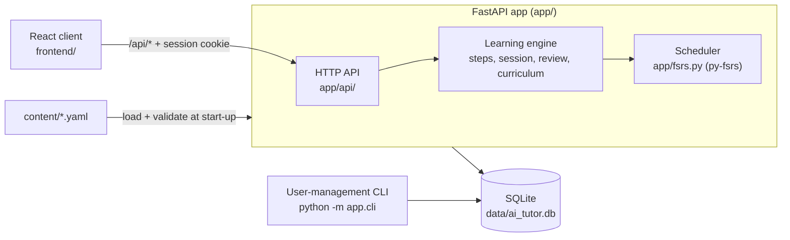
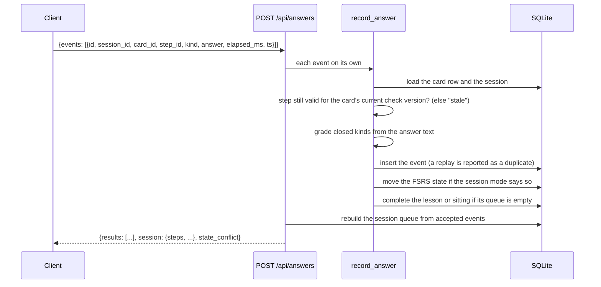

# Architecture

AI Tutor is one Python process serving a JSON API and a prebuilt React client from the same origin, with SQLite as its only store. The course itself lives in YAML files in `content/`; the database holds a synced copy of it plus everything learners do.

## Components

### FastAPI app

- `app/main.py` builds the app. On start-up it applies pending migrations, loads and validates the course (refusing to start, with every problem listed, if the content is invalid), syncs the course into the database and drops expired sign-in sessions. It also serves the built client from `static/` and answers unknown `/api/*` paths with 404 instead of the client shell.
- `app/api/accounts.py`: registration (when open), sign-in, sign-out, password change and per-learner settings.
- `app/api/learning.py`: the home board (`/api/chapters`), starting lessons, reviews and practice, the current session (`/api/session`), answers (`/api/answers`) and progress (`/api/progress`).
- `app/security.py`: security headers on every response, a 256 KB limit on API request bodies, client-address resolution behind a proxy and the SQLite-backed rate limiter.
- `app/settings.py`: configuration from environment variables (see the table in the [README](../README.md#configuration)).
- `/api/health` reports the app version, the build's `git_sha`, the loaded course's `program_version` and live chapter, lesson and card counts; deploys wait for it. There is no generated OpenAPI page: it would need inline scripts that the CSP forbids.

### Learning engine

| Module | Responsibility |
|---|---|
| `app/steps.py` | The five step kinds, a card's rungs and primary check, step ids, server-side verdicts, and the per-card ladder state derived from events. Pure functions, no database access. |
| `app/session.py` | Builds the queue of a lesson, review or practice session from accepted answers, and `record_answer`, the only way an answer enters the system. |
| `app/review.py` | Which cards a scheduled review sitting (at most 10 cards) or a practice session contains, and the frozen plan for the day. |
| `app/curriculum.py` | The home board: chapters, lessons, the next lesson, readiness counts and the progress metrics. |
| `app/fsrs.py` | Maps an answer to an FSRS rating and moves a card's schedule with py-fsrs, using the course's `schedule` settings. |
| `app/daytime.py` | The course-local day (time zone and `day_starts_at_hour`) that reviews and plans are keyed on. |

How the exercises, the ladder and readiness behave for a learner is described in [exercises.md](exercises.md).

### SQLite schema

Migrations live in `migrations/` and are applied in file-name order at start-up and by the user-management CLI. The schema has four groups:

| Group | Tables | Notes |
|---|---|---|
| Accounts | `users`, `auth_sessions`, `rate_limit_hits` | Sessions are stored by the SHA-256 of their token. Rate-limit hits are kept for a day. |
| Course | `chapters`, `lessons`, `cards`, `meta` | A synced copy of `content/`. Each card row also stores what the engine derives from it: rungs, the cloze gap and options, whether `assemble` applies, and the check fingerprint (`check_hash`, `check_epoch`, `check_version`). Nothing is deleted: removed content is marked `retired`. |
| Learning history | `events` | One row per accepted answer, with its step id, verdict, rating and the `check_version` it was given under. Unique indexes on the step id make replays harmless. |
| Learner state | `card_state`, `user_lesson_state`, `study_sessions`, `user_meta` | FSRS state per learner and card; lesson completion; review and practice sittings with their card lists; per-learner settings. |

### Content loader and validator

`app/content.py` defines the content model with Pydantic (unknown fields and duplicate YAML keys are errors), checks cross-references and the exercise rules, and computes each card's check hash and the course's `program_version`. `scripts/validate_content.py` is the command-line front end (`make validate`) that also prints the exercise coverage per chapter. The same validation runs in four places: `make validate`, CI, the Docker build and app start-up. The contract is in [content-contract.md](content-contract.md).

### React client

`frontend/` is a Vite + React + TypeScript app. `src/api.ts` is the typed API client; `src/screens/` holds the screens (sign-in, home, session, done, progress, settings) and `src/components/` the step views and shared pieces. The client renders what the server sends: it keeps no learning state of its own beyond the step on screen (only the theme choice is stored in the browser). The theme is applied from the bundle before the first render, so the page needs no inline script. Unit tests run with Vitest, browser tests with Playwright in `frontend/e2e/`.

## The life of an answer

1. The client shows the first step of the session payload. A step carries its id, kind, prompt, answer, hint and note, plus the buttons, gap or tiles of a closed kind.
2. The learner answers; the client posts the event to `/api/answers`. A batch takes up to 100 events, and each is applied on its own, so one bad event cannot block the rest.
3. `record_answer` validates the event, refuses a step the engine would no longer issue (`stale`), grades a closed step from the answer text (a `correct` flag sent by the client is ignored), stores it and updates the schedule: in lessons and reviews, triage, flash and primary checks move it; in practice, only a missed primary check does (or any primary-check answer on a card with no schedule yet).
4. The response carries a result per event and the session's continuation, rebuilt from the database. The client shows the verdict, then the next step the server sent.

## Invariants

- **The server is the source of truth.** Every session queue is rebuilt from accepted events, so a reload or a second device continues with the same sequence. The client holds no schedule, no ladder and no progress.
- **Grading is server-side.** The verdict on `choice`, `cloze` and `assemble` is recomputed from the answer text; comparisons ignore case, accents and repeated whitespace. Only closed primary checks decide whether a card is ready.
- **Events are idempotent.** An event replayed with the same id, or a second answer to the same step, is reported as a duplicate and changes nothing. A client may resend its buffer safely.
- **Step ids are pinned to a card version.** Every step id contains the first 8 hex characters of the card's `check_version`. After an edit of a card's answer material, old steps are rejected as stale and old events no longer count; the epoch in the version only grows, so reverting an edit also starts the card over.
- **Content has a lifecycle, not a migration.** The course is synced by id on every start: wording edits keep progress, answer edits reset that card's schedule for everyone, removed items are retired with their history and come back with it if the id returns. The full table is in [content-contract.md](content-contract.md#lifecycle-what-happens-when-content-changes).
- **Invalid content never runs.** The validator blocks the commit (by convention), CI, the image build and start-up.

## Design decisions

- **The answer travels with the step.** A step payload includes the answer and note before the learner answers, so the client can show the card's back the moment it is answered without a second request. Grading still happens on the server, and AI Tutor is a self-study tool: a learner who reads the payload only cheats themselves. The trade-off favours a simpler client.
- **Registration is closed by default.** A deploy is for one person or a small group the owner knows; accounts are created with `python -m app.cli create-user`. `REGISTRATION=open` turns on self-service sign-up, with its own rate limit.
- **No HTTP admin.** Account management and backups are user-management CLI commands run on the server (`docker compose exec app python -m app.cli ...`). There is no admin endpoint to protect, brute-force or forget to protect.
- **SQLite and one process.** The expected scale is a person or a team, not thousands of concurrent users. One file to back up (with an online backup command) beats a database server to run.
- **Content in git, not in a database UI.** Cards are YAML authored by an agent and reviewed as a diff; the validator, not a form, enforces the rules.
