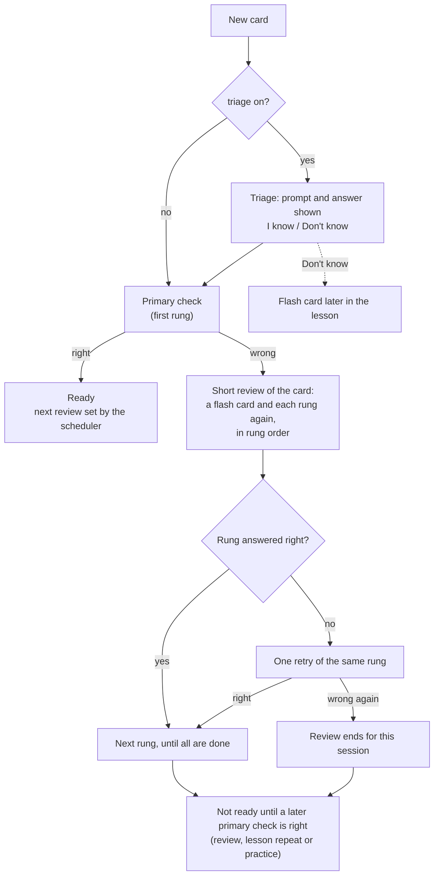

# Exercises

AI Tutor has five kinds of step. Two are learning steps that the learner grades themselves. Three are closed exercises: the learner picks or arranges given material, and the server checks the answer itself. Only closed exercises can show that a card is known.

| Kind | Type | What the learner does | How it is graded | Can be turned off |
|---|---|---|---|---|
| `triage` | learning | Sees a new card with its answer and says "I know" or "Don't know". | Self-assessment. | yes |
| `flash` | learning | Sees the prompt, reveals the answer, says "Got it" or "Again". | Self-assessment. | no |
| `choice` | closed | Picks the right answer among four buttons: `option` and the 3 `distractors`, shuffled. | The chosen text equals `option`. | yes |
| `cloze` | closed | Sees `answer` with a gap and fills it from buttons: the key and the distractors with the same number of words. | The chosen text equals the key. | yes |
| `assemble` | closed | Rebuilds `answer` from its words, shuffled into tiles. | The rebuilt text equals `answer`. | yes |

Every comparison ignores case, accents and repeated whitespace (`Café` = `cafe`); there is no other fuzzy matching. The client never decides whether an answer was right: the server recomputes every verdict from the answer text.

## Turning kinds on and off

`program.yaml` sets the defaults for every chapter, and a chapter can override single kinds:

```yaml
# program.yaml
exercises:
  triage: true
  choice: true
  cloze: true
  assemble: false
```

```yaml
# chapters/foundations.yaml
exercises: {assemble: true}   # this chapter also uses assemble; the rest is inherited
```

Left out, the defaults are `triage: true`, `choice: true`, `cloze: true`, `assemble: false`. `flash` has no switch: it is how a missed card is studied again, so it is always available. Each chapter must enable at least one closed kind.

## Which cards support which kind

A kind that is switched on still applies only to cards whose data supports it:

| Kind | Supported when |
|---|---|
| `triage`, `flash` | always |
| `choice` | the card has exactly 3 `distractors` |
| `cloze` | `key_mode` is `any_of`; a key (`accepted`, by default `option`) appears in `answer` on word boundaries; at least 3 words remain outside it; the rest of the answer does not contain the key again; at least 2 distractors have as many words as the key |
| `assemble` | `answer` has 4 to 8 words |

`make validate` prints, per chapter, how many cards support each closed kind, and warns when a kind is on but no card in the chapter supports it. Field details are in [content-contract.md](content-contract.md).

## Rungs and the primary check

A card's **rungs** are the closed kinds its chapter enables *and* its data supports, always in the order `choice` → `cloze` → `assemble`:

```
rungs(card) = [kind for kind in (choice, cloze, assemble) if enabled(chapter, kind) and supported(card, kind)]
```

The first rung is the card's **primary check**. A card must have at least one rung, otherwise validation fails with a hint on how to give it one.

| Chapter enables | Card supports | Rungs | Primary check |
|---|---|---|---|
| choice, cloze | choice, cloze, assemble | choice, cloze | choice |
| choice, cloze, assemble | choice, cloze, assemble | choice, cloze, assemble | choice |
| cloze, assemble | choice, cloze, assemble | cloze, assemble | cloze |
| choice, cloze | assemble only | none: validation error | |

Turning `choice` off in a chapter makes its checks harder: the primary check becomes `cloze` (the answer in context) or `assemble` (the whole wording).

## A card in a lesson



1. **Triage** (when on) shows each card the learner has never met, with its answer. It is a first look, not a test: either way the card still gets its primary check. "Don't know" also adds a flash card later in the lesson. With triage off, new cards start directly at the primary check.
2. **Primary check.** Each card of the lesson gets one primary check per session. A right answer makes the card ready.
3. **After a miss** the card gets a short review: a flash card and each of its rungs again, in rung order, starting a few exercises after the miss. Each rung must be answered right before the next one appears; a wrong answer gets one retry, and a second miss on the same rung ends the review for this session instead of grinding on. In longer lessons the first rung can come before the flash card, so do not rely on an exact order. Ladder rungs are practice: they never make a card ready.
4. The lesson is done when nothing is left in its queue: every card has had its primary check, and every missed card has had its review.

**Readiness** is exactly this: the last primary check of the card was answered right. Triage and flash are self-assessment and ladder rungs are scaffolding, so none of them counts. Progress in the app is the number of ready cards.

## Reviews and practice

- **Review** (`Review N cards` on Home) serves cards that are due by the schedule, at most 10 per sitting. There is no triage; each card gets a primary check, and a miss opens the same short review as in a lesson.
- **Lesson repeat** and **mixed practice** reuse the same steps. Practice is for staying sharp, so a right answer there does not push the next review further out; a missed primary check still counts as a lapse.

The schedule uses FSRS with the `schedule` settings from `program.yaml`. "I know", "Got it" and a right closed answer count as *Good*; "Don't know", "Again" and a wrong answer count as *Again*.

## Changing the settings later

Exercise switches apply to the steps served from the next request on. Nobody's schedule is reset. An open session carries on: a step that the new settings no longer allow is rejected as stale and skipped. Changing `triage` affects only cards a learner has not met yet. What happens when the cards themselves change is described in [content-contract.md](content-contract.md#lifecycle-what-happens-when-content-changes).
